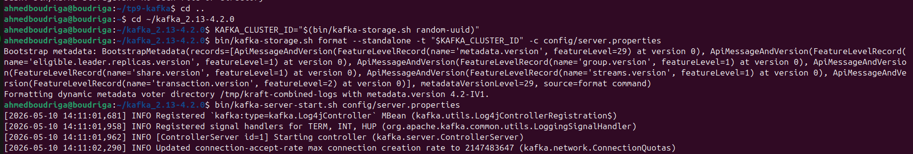
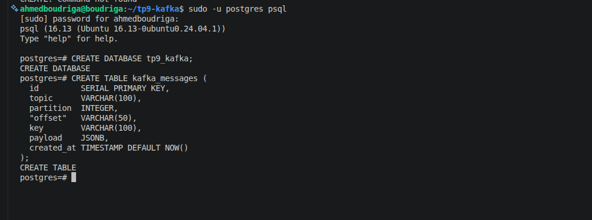
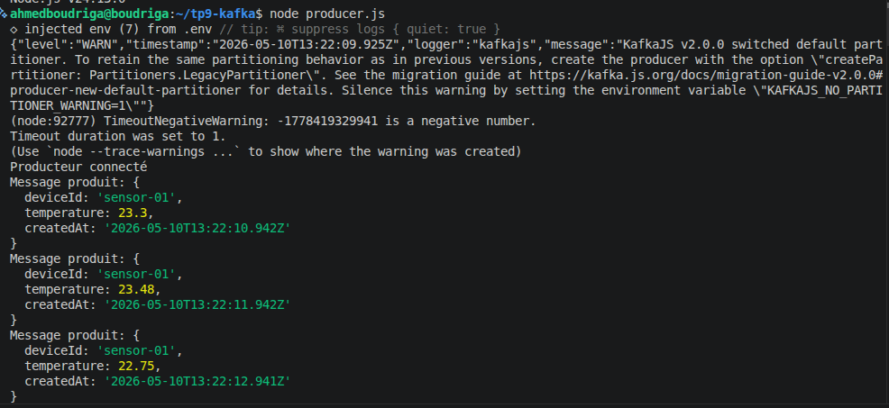
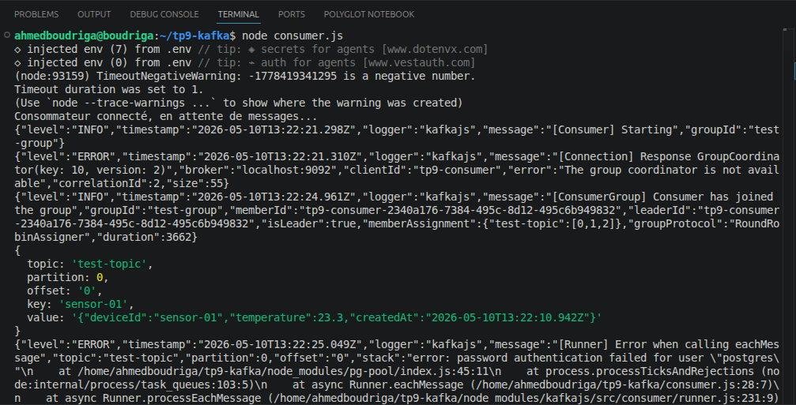
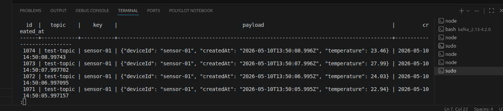
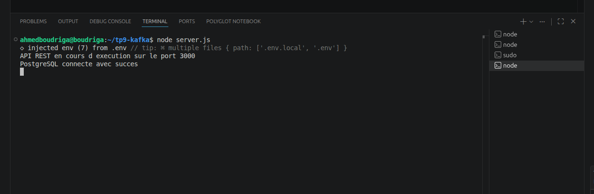
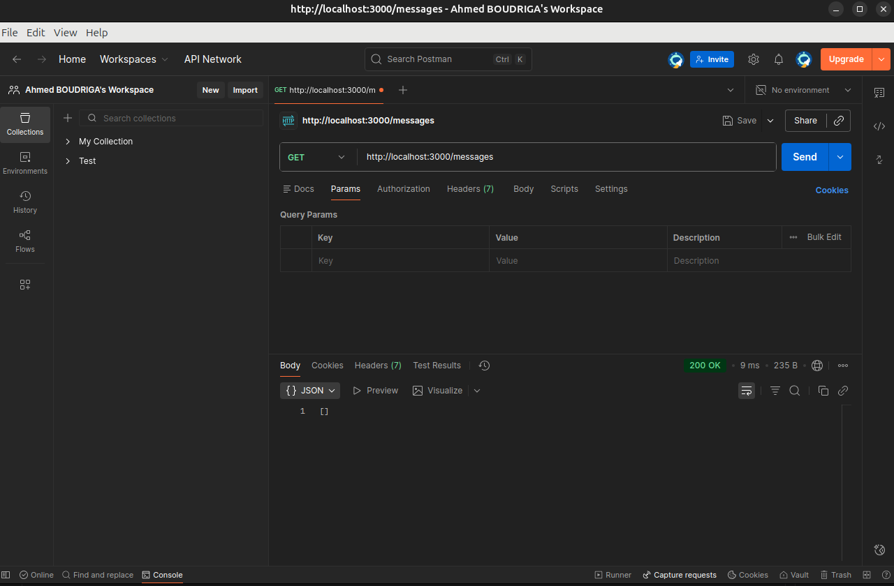
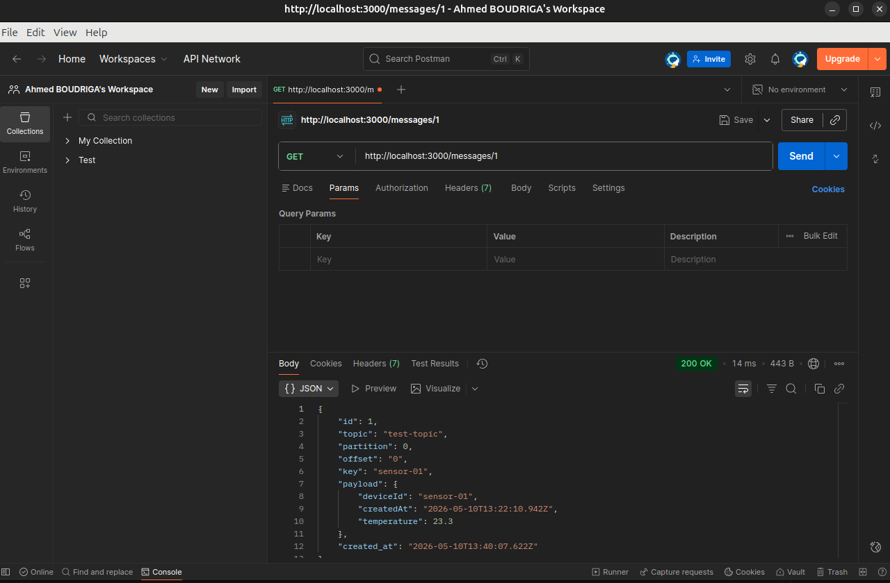

# TP9 — Intégration et Manipulation de Données avec Apache Kafka

> **Matière :** SoA et Microservices &nbsp;|&nbsp; **Enseignant :** Dr. Salah Gontara &nbsp;|&nbsp; **Classe :** 4Info &nbsp;|&nbsp; **A.U. :** 2025/2026  
> **Étudiant :** Ahmed BOUDRIGA  
> **Outils :** Kafka 4.2, KRaft, Node.js, KafkaJS, Express.js 5, PostgreSQL

---

## ✅ Statut — Flux complet validé

| Étape | Technologie | Statut |
|-------|-------------|--------|
| Kafka KRaft démarré | `kafka-server-start.sh` | ✅ OK |
| Producteur connecté | `KafkaJS Producer` | ✅ OK |
| Consommateur → PostgreSQL | `KafkaJS Consumer + pg` | ✅ OK |
| Persistance base de données | 1074+ messages insérés | ✅ OK |
| `GET /messages` | Express.js 5 | ✅ 200 OK |
| `GET /messages/:id` | Express.js 5 | ✅ 200 OK |

---

## 📁 Structure du projet

```
tp9-kafka/
├── capture/
│   ├── kafka_server.png
│   ├── psql_create.png
│   ├── terminal_producteur.png
│   ├── terminal_consommateur.png
│   ├── terminal_api.png
│   ├── get_messages.png
│   ├── get_messages_id.png
│   └── verification_pgsql.png
├── node_modules/
├── .env
├── consumer.js
├── db.js
├── package.json
├── producer.js
└── server.js
```


---

## 🏗️ Architecture

```
producer.js
    │
    │  (1 message/seconde — JSON sensor data)
    ▼
┌─────────────────────────────┐
│   Kafka Broker (KRaft)      │
│   Topic : test-topic        │
│   Partitions : [0, 1, 2]    │
└─────────────────────────────┘
    │
    │  (subscribe — group: test-group)
    ▼
consumer.js
    │
    │  (INSERT INTO kafka_messages)
    ▼
┌─────────────────────────────┐
│   PostgreSQL — tp9_kafka    │
│   Table : kafka_messages    │
└─────────────────────────────┘
    │
    │  (SELECT)
    ▼
server.js — API REST :3000
    ├── GET /messages
    └── GET /messages/:id
```

---

## ⚙️ Installation & Configuration

### Prérequis

- Java 17+
- Node.js
- Kafka 4.2 ([kafka_2.13-4.2.0](https://kafka.apache.org/downloads))
- PostgreSQL 16

### Variables d'environnement (`.env`)

```env
KAFKA_BROKER=localhost:9092
KAFKA_TOPIC=test-topic
PG_HOST=localhost
PG_PORT=5432
PG_USER=postgres
PG_PASSWORD=postgres
PG_DATABASE=tp9_kafka
```

### Dépendances Node.js

```bash
npm install kafkajs express pg dotenv
```

---

## 🚀 Étape 1 — Démarrage Kafka en mode KRaft

Kafka 4.2 ne nécessite plus ZooKeeper. On génère un Cluster ID et on formate le stockage KRaft :

```bash
# Générer le Cluster ID et formater
KAFKA_CLUSTER_ID="$(bin/kafka-storage.sh random-uuid)"
bin/kafka-storage.sh format --standalone -t "$KAFKA_CLUSTER_ID" -c config/server.properties

# Démarrer le serveur Kafka
bin/kafka-server-start.sh config/server.properties
```



---

## 🗄️ Étape 2 — Configuration PostgreSQL

```sql
CREATE DATABASE tp9_kafka;

CREATE TABLE kafka_messages (
  id         SERIAL PRIMARY KEY,
  topic      VARCHAR(100),
  partition  INTEGER,
  "offset"   VARCHAR(50),
  key        VARCHAR(100),
  payload    JSONB,
  created_at TIMESTAMP DEFAULT NOW()
);
```



---

## 📤 Étape 3 — Terminal 1 : Producteur Kafka

Le producteur envoie **1 message JSON par seconde** au topic `test-topic`.

```bash
node producer.js
```

Exemple de message produit :

```json
{
  "deviceId": "sensor-01",
  "temperature": 23.3,
  "createdAt": "2026-05-10T13:22:10.942Z"
}
```



---

## 📥 Étape 4 — Terminal 2 : Consommateur Kafka

Le consommateur souscrit au topic, parse le payload JSON et insère chaque message dans PostgreSQL.

```bash
node consumer.js
```



---

## 🗃️ Étape 5 — Vérification PostgreSQL

```sql
-- Vérifier les derniers messages insérés
SELECT id, topic, key, payload, created_at
FROM kafka_messages
ORDER BY id DESC
LIMIT 5;

-- Compter le total
SELECT COUNT(*) FROM kafka_messages;
-- Résultat : 1074 lignes
```



---

## 🌐 Étape 6 — Terminal 3 : API REST Express.js

```bash
node server.js
# API REST en cours d'exécution sur le port 3000
# PostgreSQL connecté avec succès
```



---

## 🧪 Étape 7 — Tests Postman

### `GET /messages` — Récupérer tous les messages

```
GET http://localhost:3000/messages
→ 200 OK | 9ms | 235 B
```



---

### `GET /messages/:id` — Récupérer un message par ID

```
GET http://localhost:3000/messages/1
→ 200 OK | 14ms | 443 B
```

Réponse JSON :

```json
{
  "id": 1,
  "topic": "test-topic",
  "partition": 0,
  "offset": "0",
  "key": "sensor-01",
  "payload": {
    "deviceId": "sensor-01",
    "createdAt": "2026-05-10T13:22:10.942Z",
    "temperature": 23.3
  },
  "created_at": "2026-05-10T13:40:07.622Z"
}
```



---

## 📝 Code source

### `producer.js`

```javascript
const { Kafka } = require('kafkajs');
require('dotenv').config();

const kafka = new Kafka({
  clientId: 'tp9-producer',
  brokers: [process.env.KAFKA_BROKER || 'localhost:9092'],
});

const producer = kafka.producer();
const topic = process.env.KAFKA_TOPIC || 'test-topic';

const run = async () => {
  await producer.connect();
  console.log('Producteur connecté');
  setInterval(async () => {
    const event = {
      deviceId: 'sensor-01',
      temperature: Number((20 + Math.random() * 10).toFixed(2)),
      createdAt: new Date().toISOString(),
    };
    await producer.send({
      topic,
      messages: [{ key: event.deviceId, value: JSON.stringify(event) }],
    });
    console.log('Message produit:', event);
  }, 1000);
};

run().catch(console.error);
```

### `consumer.js`

```javascript
const { Kafka } = require('kafkajs');
const { pool } = require('./db');
require('dotenv').config();

const kafka = new Kafka({
  clientId: 'tp9-consumer',
  brokers: [process.env.KAFKA_BROKER || 'localhost:9092'],
});

const consumer = kafka.consumer({ groupId: 'test-group' });
const topic = process.env.KAFKA_TOPIC || 'test-topic';

const run = async () => {
  await consumer.connect();
  console.log('Consommateur connecté, en attente de messages...');
  await consumer.subscribe({ topic, fromBeginning: true });
  await consumer.run({
    eachMessage: async ({ topic, partition, message }) => {
      const key = message.key?.toString();
      const value = message.value?.toString();
      const payload = JSON.parse(value);
      const offset = message.offset;

      console.log({ topic, partition, offset, key, value });

      await pool.query(
        `INSERT INTO kafka_messages (topic, partition, "offset", key, payload)
         VALUES ($1, $2, $3, $4, $5)`,
        [topic, partition, offset, key, payload]
      );
    },
  });
};

run().catch(console.error);
```

### `server.js`

```javascript
const express = require('express');
const { pool } = require('./db');
require('dotenv').config();

const app = express();
const PORT = process.env.PORT || 3000;

// GET tous les messages
app.get('/messages', async (req, res) => {
  const result = await pool.query(
    'SELECT * FROM kafka_messages ORDER BY id DESC'
  );
  res.json(result.rows);
});

// GET un message par ID
app.get('/messages/:id', async (req, res) => {
  const { id } = req.params;
  const result = await pool.query(
    'SELECT * FROM kafka_messages WHERE id = $1',
    [id]
  );
  if (result.rows.length === 0) {
    return res.status(404).json({ error: 'Message non trouvé' });
  }
  res.json(result.rows[0]);
});

app.listen(PORT, () => {
  console.log(`API REST en cours d'exécution sur le port ${PORT}`);
});
```

### `db.js`

```javascript
const { Pool } = require('pg');
require('dotenv').config();

const pool = new Pool({
  host:     process.env.PG_HOST     || 'localhost',
  port:     process.env.PG_PORT     || 5432,
  user:     process.env.PG_USER     || 'postgres',
  password: process.env.PG_PASSWORD || 'postgres',
  database: process.env.PG_DATABASE || 'tp9_kafka',
});

pool.connect()
  .then(() => console.log('PostgreSQL connecté avec succès'))
  .catch(err => console.error('Erreur connexion PostgreSQL:', err));

module.exports = { pool };
```

---

## 🎯 Conclusion

Le TP a été réalisé et validé avec succès. Le pipeline complet fonctionne de bout en bout :

- **Kafka 4.2** en mode KRaft (sans ZooKeeper)
- **Topic** `test-topic` avec 3 partitions
- **Producteur** envoyant des données de capteur en temps réel (1 msg/sec)
- **Consommateur** parsant et persistant dans PostgreSQL (1074+ messages)
- **API REST** exposant les données via deux endpoints testés avec Postman

---

*TP9 — SoA et Microservices | 4Info | 2025/2026*